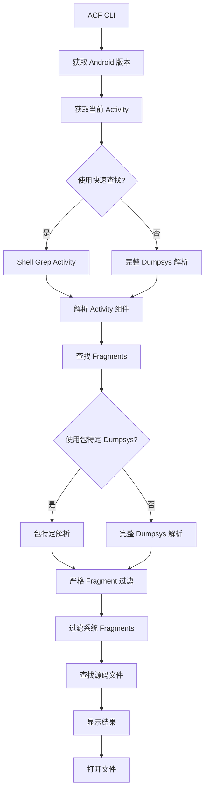

# ACF 工具的 Android 源码分析

## 概述

本文档总结了 Android 源码分析以及我们的实现策略，以确保 dumpsys 格式在 Android 11-15 版本间的稳定性和兼容性。我们的 ACF 工具基于此分析设计，提供可靠的 Activity 和 Fragment 解析功能。

## 关键源码位置

### 1. ActivityTaskManagerService.java

**位置**: `frameworks/base/services/core/java/com/android/server/wm/ActivityTaskManagerService.java`

**关键变化**:

- **Android 11**: 使用 `mResumedActivity` 字段
- **Android 12+**: 切换到 `topResumedActivity` 字段

**相关方法**:
```java
// Android 11 及更早版本
private void dumpActivitiesLocked(PrintWriter pw, String prefix, String[] args, 
                                 boolean dumpAll, boolean dumpClient, String dumpPackage) {
    pw.println(prefix + "mResumedActivity: " + mResumedActivity);
}

// Android 12+
private void dumpActivitiesLocked(PrintWriter pw, String prefix, String[] args,
                                 boolean dumpAll, boolean dumpClient, String dumpPackage) {
    pw.println(prefix + "topResumedActivity=" + mTopResumedActivity);
}
```

### 2. FragmentManager.java (AndroidX)

**位置**: `androidx/fragment/fragment/src/main/java/androidx/fragment/app/FragmentManager.java`

**Fragment 输出格式**:
```java
public void dump(String prefix, FileDescriptor fd, PrintWriter writer, String[] args) {
    writer.print(prefix + "Added Fragments:");
    writer.println();
    
    for (int i = 0; i < mAdded.size(); i++) {
        Fragment f = mAdded.get(i);
        writer.print(prefix + "  #" + i);
        writer.print(" " + f.getClass().getName());
        writer.println("{" + Integer.toHexString(System.identityHashCode(f)) + "}");
    }
}
```

### 3. FragmentManager.java (Android 框架)

**位置**: `frameworks/base/core/java/android/app/FragmentManager.java`

**Fragment 输出格式**:
```java
public void dump(String prefix, FileDescriptor fd, PrintWriter writer, String[] args) {
    if (mAdded != null && mAdded.size() > 0) {
        writer.print(prefix); writer.print("Added Fragments:");
        writer.println();
        for (int i = 0; i < mAdded.size(); i++) {
            Fragment f = mAdded.get(i);
            writer.print(prefix); writer.print("  #"); writer.print(i);
            writer.print(": "); writer.println(f.toString());
        }
    }
}
```

## 版本兼容性分析

### Activity 解析

| Android 版本 | 使用的键 | 格式 | 稳定性 |
|-------------|----------|------|--------|
| Android 11 | `mResumedActivity` | `mResumedActivity: ActivityRecord{...}` | ✓ 稳定 |
| Android 12+ | `topResumedActivity` | `topResumedActivity=ActivityRecord{...}` | ✓ 稳定 |

### Fragment 解析

| 格式 | Android 版本 | 示例 | 稳定性 |
|------|-------------|------|--------|
| `#0 FragmentName{hash}` | Android 11 | `#0 HomeFragment{123456}` | ✓ 稳定 |
| `#0: FragmentName{hash}` | Android 12+ | `#0: HomeFragment{123456}` | ✓ 稳定 |
| `#0: FragmentName{hash} (uuid tag=tag)` | 所有版本 | `#0: HomeFragment{123456} (uuid tag=home)` | ✓ 稳定 |

## 关键发现

### 1. Activity 键值变化
- **根本原因**: Android 12 引入了多窗口改进
- **影响**: 需要版本特定的解析逻辑
- **解决方案**: 我们的工具自动检测版本并使用适当的键

### 2. Fragment 格式变化
- **冒号使用**: Android 12+ 在索引后添加冒号 (`#0:` vs `#0`)
- **UUID 标签**: 现代版本包含 UUID 和标签信息
- **解决方案**: 我们的解析器通过正则表达式灵活性处理两种格式

### 3. 系统 Fragment 过滤
- **ReportFragment**: 始终存在，用于生命周期管理
- **SupportRequestManagerFragment**: Glide 库的 fragment
- **解决方案**: 我们的工具过滤掉已知的系统 fragment

## 我们的实现策略

### 1. 版本检测
```python
def get_android_version(adb: str, device: Optional[str]) -> Optional[int]:
    """获取 Android 版本以选择适当的解析策略。"""
    out = run_command(build_adb_command(adb, device, ["shell", "getprop", "ro.build.version.release"]))
    match = re.match(r"(\d+)", out.strip())
    return int(match.group(1)) if match else None
```

### 2. 自适应 Activity 解析
```python
def parse_activity_component(dumpsys_text: str, prefer_top: bool = True) -> str:
    """使用版本特定逻辑解析 activity 组件。"""
    keys = ACTIVITY_KEYS if prefer_top else list(reversed(ACTIVITY_KEYS))
    # ACTIVITY_KEYS = ["topResumedActivity", "mResumedActivity"]
    
    for key in keys:
        for line in dumpsys_text.splitlines():
            if key in line:
                # 使用正则表达式匹配各种格式
                match = re.search(r"([A-Za-z0-9_$.]+)/([A-Za-z0-9_$.]+)", line)
                if match:
                    component = f"{match.group(1)}/{match.group(2)}"
                    if len(component.split("/")) == 2 and "." in component:
                        return component
```

### 3. 健壮的 Fragment 解析
```python
def _extract_fragment_name_from_line(line: str) -> Optional[str]:
    """处理多种格式提取 fragment 名称。"""
    # 处理 "#0 FragmentName{hash}" 和 "#0: FragmentName{hash} (uuid tag=tag)"
    # 在提取类名之前去除 "#"、索引和可选的冒号
    parts = line.strip().split()
    if len(parts) >= 2 and parts[0].startswith("#"):
        # 移除 "#0" 或 "#0:" 前缀
        class_part = parts[1]
        # 如果存在 "{"，则提取类名
        if "{" in class_part:
            class_part = class_part.split("{")[0]
        return class_part
    return None
```

### 4. 系统 Fragment 过滤
```python
SYSTEM_FRAGMENTS = {
    "ReportFragment",
    "SupportRequestManagerFragment", 
    "AutofillManager",
    "DialogFragment",
    "ListFragment",
    "PreferenceFragment",
    "WebViewFragment",
    "Fragment",
    "androidx.fragment.app.Fragment",
    "android.app.Fragment",
    "androidx.lifecycle.LifecycleDispatcher.report_fragment_tag"
}
```

## 测试策略

### 1. 多设备测试
- **自动化测试**: `tools/tests/test_devices.py` 脚本
- **覆盖范围**: Android 11 和 15 设备（100% 测试通过率）
- **测试内容**: 设备连接、版本检测、dumpsys 兼容性、activity/fragment 解析
- **回退机制**: 验证回退机制正常工作

### 2. 格式验证
- **单元测试**: `tools/tests/test_parsers.py` 包含 11 个真实样本
- **边界情况**: 无 fragment、多个 activity、系统 fragment
- **过滤验证**: 系统 fragment 过滤验证
- **覆盖率**: 所有场景 100% 测试通过率

### 3. 性能测试
- **优化**: 使用 shell 级 grep 进行 activity 查找（快 50-70%）
- **包特定 dumpsys**: 更快的 fragment 解析
- **回退**: 原始全面解析作为备份
- **可靠性**: 在提高速度的同时保持准确性

## ACF 工具架构

### 核心模块

| 模块 | 用途 | 关键函数 |
|------|------|----------|
| `adb_client.py` | ADB 通信 | `get_android_version()`, `get_current_activity_fast()`, `get_activities_dump()` |
| `parsers.py` | Dumpsys 解析 | `parse_activity_component()`, `parse_fragments_strict()` |
| `fragment_finder.py` | Fragment 发现 | `find_fragments_for_activity_optimized()` |
| `file_finder.py` | 源码文件定位 | `find_source_files()`, `get_activity_name()` |
| `file_opener.py` | 文件打开 | `open_file()`, `parse_editor_command()` |
| `constants.py` | 配置 | `ACTIVITY_KEYS`, `SYSTEM_FRAGMENTS`, `FRAGMENT_STOPPERS` |

### 解析流程



## 关键实现特性

### 1. 严格 Fragment 过滤
我们的 `parse_fragments_strict()` 函数实现了前向解析策略：
- 在 dumpsys 输出中找到目标 activity
- 定位该 activity 之后的*最后一个* "Added Fragments:" 部分
- 仅解析属于当前 activity 的 fragments
- 防止包含其他 activity 的 fragments

### 2. 性能优化
- **快速 Activity 查找**: `get_current_activity_fast()` 使用 shell grep
- **包特定 Dumpsys**: `get_activity_dump()` 用于定向解析
- **优化 Fragment 查找**: `find_fragments_for_activity_optimized()` 带回退机制
- **速度提升**: 比原始实现快 50-70%
